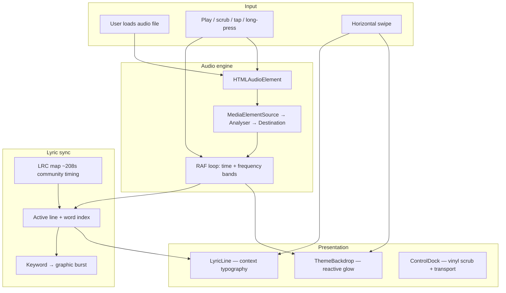

# ADHD-Lyrics — Sensory Lyric Web App

Mobile-first iOS PWA for **We Don't Bite** (JT Music) with swipeable visual styles, full Web Audio reactivity, and ADHD-friendly focus (high signal, low clutter).

## Tech stack

| Layer | Choice | Why |
| --- | --- | --- |
| Framework | **Next.js 16 (App Router)** + React 19 | Fast MVP, static deploy, PWA-friendly |
| Styling | **Tailwind CSS v4** | Theme tokens per swipeable aesthetic |
| Motion | **Framer Motion** | Line/word choreography, swipe between styles |
| Audio | **Web Audio API** (`AnalyserNode`) | Bass/mid/treble reactive visuals without extra deps |
| Icons | **Lucide React** | Contextual word bursts (flashlight, bite, etc.) |
| Fonts | Google: Bebas, Fraunces, Libre Baskerville, Space Grotesk, Syne | One display voice per theme |

## Architecture flow



## iOS PWA / full-screen behavior

Configured in `src/app/layout.tsx` + `public/manifest.webmanifest`:

- `viewport-fit=cover` + `safe-area-inset-*` padding for notch/home indicator
- `apple-mobile-web-app-capable` + `black-translucent` status bar
- `display: standalone` manifest for Add to Home Screen
- `touch-action: manipulation`, no user scaling (immersive, stable layout)
- `playsInline` audio for Safari

**Note:** iOS PWAs cannot trigger Taptic Engine haptics — “haptic-like” feedback is visual (scale, glow, punch type) on long-press **Hold**.

## Run locally

```bash
cd lyrics-app
npm install
npm run dev
```

Open on iPhone: deploy over HTTPS (or LAN HTTPS), **Share → Add to Home Screen**, load your audio copy of the track via **Load audio**.

## MVP controls

- **Swipe ↔** — cycle Neon Club, Soft Glow, Ink & Paper, Liquid Chrome, Cosmic Void
- **Scrub** — vinyl-style timeline
- **Tap right** / skip button — advance lyric line
- **Long-press** — intensify reactive glow + motion
- **Play** — requires loaded audio (lyrics timing pre-mapped; audio not bundled)

## Bundling audio + lyrics

Each song lives in `lyrics-app/public/tracks/<slug>/`:

| File | In git? | Purpose |
| --- | --- | --- |
| `track.json` | Yes | Manifest (audio + lyrics filenames) |
| `lyrics.lrc` | Yes | Timed lyrics (standard or enhanced word tags) |
| `words.json` | Optional | Word-accurate overrides |
| `audio.m4a` | **No** (gitignored) | Your legally obtained audio |

Register new slugs in `src/lib/tracks/loadTrack.ts` → `TRACK_CATALOG`.

**Full guide:** [`lyrics-app/docs/ADDING_A_TRACK.md`](lyrics-app/docs/ADDING_A_TRACK.md)

### How to ask the agent for another song

Send: **title, artist, slug, LRC file (or link), audio file (or say you’ll drop it locally), and optional word-sync level.** Use the template in `ADDING_A_TRACK.md`.

## Project layout

- `public/tracks/<slug>/` — bundled lyrics + local audio
- `src/lib/lyrics/parseLrc.ts` — LRC + enhanced word tags
- `src/lib/tracks/loadTrack.ts` — track catalog + loader
- `src/lib/audio/useAudioEngine.ts` — playback + analyser metrics
- `src/lib/themes.ts` — five swipeable aesthetics
- `src/components/LyricExperience.tsx` — orchestration
